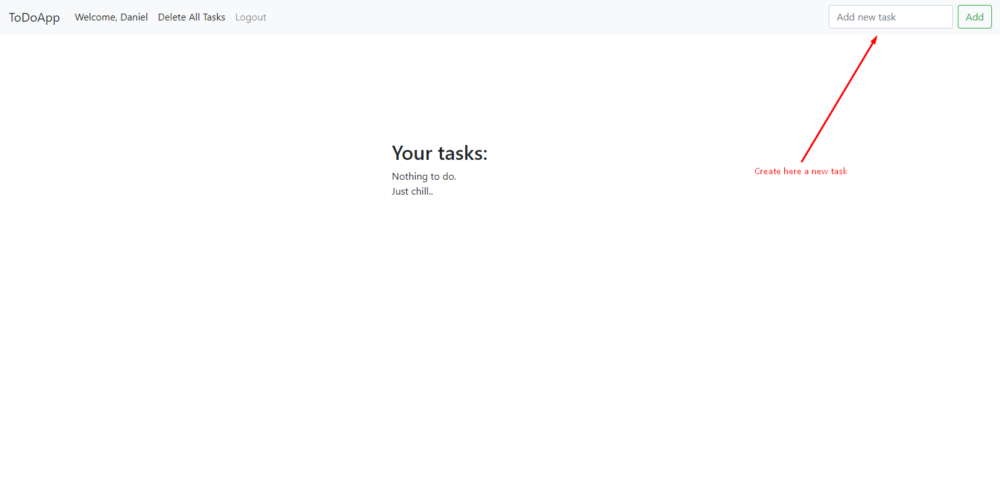
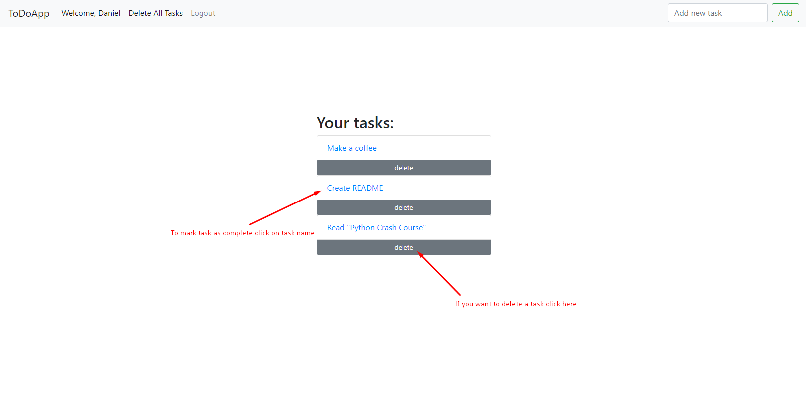
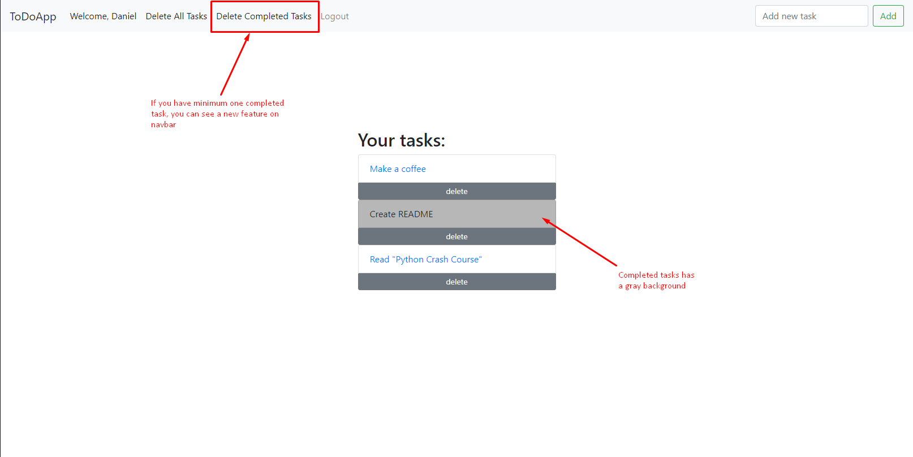
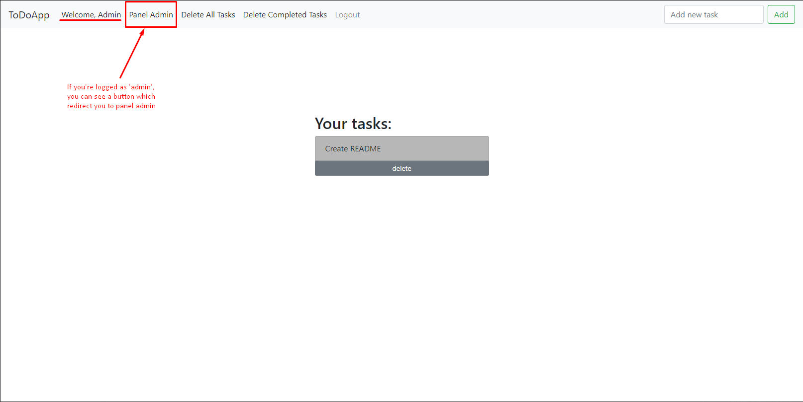

# Django-ToDoList
## Simple to-do list created with Python and Django.

## Table of contents
* [General info](#general-info)
* [Technologies](#technologies)
* [Setup](#setup)
* [Guide](#guide)

## General info
This project is simple to-do list. I created this project to learn how to use Django Framework.\
In this web application you can:
* create new account
* login
* create new task
* delete task
* delete all tasks
* delete all completed tasks
	
## Technologies
Project is created with:
* Python 3.9
* Django 3.1.2
* Bootstrap 4
	
## Setup
To run this project on Windows:
* pip install virtualvenv (for keep order)
* py -m venv myvenv
* myvenv\scripts\activate
* pip install -r requirements.txt
* py manage.py runserver

On Linux/Ubuntu:
* sudo apt install python-pip
* sudo apt install virtualenv (for keep order)
* virtualenv myvenv
* source myvenv/bin/activate
* pip install -r requirements.txt
* python manage.py runserver

## Guide
### Creating new task

### Mark task as complete / Delete task

### Delete completed tasks

### Panel Admin

